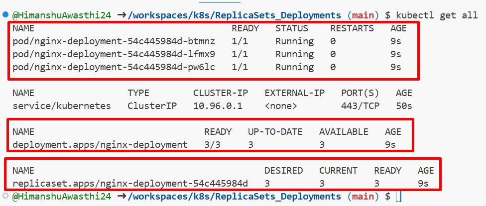
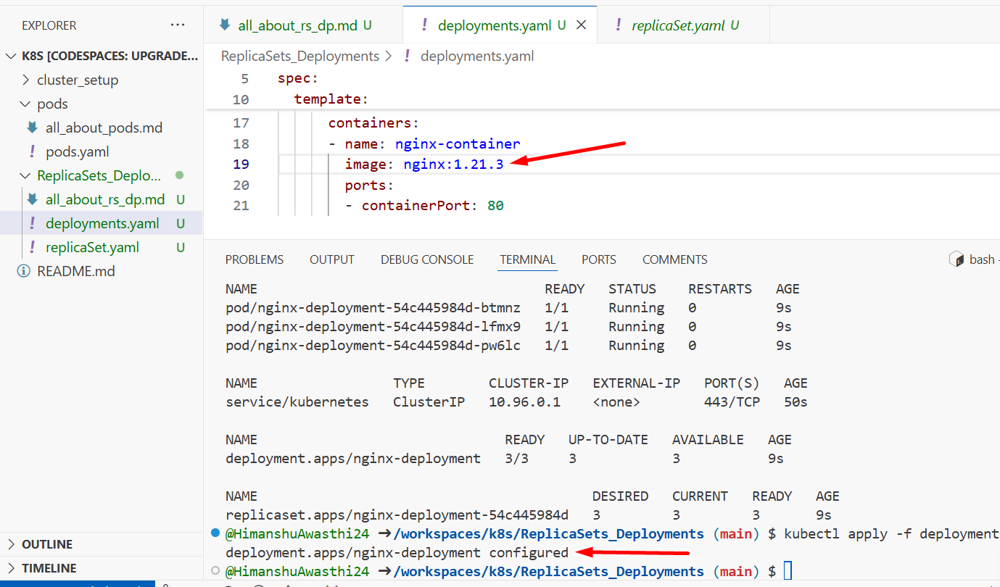
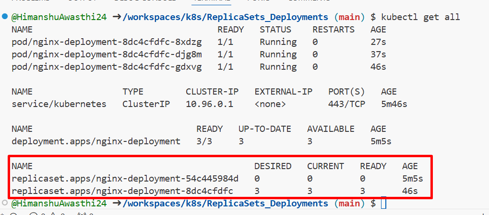

## ReplicaSets
Is resource in kubernetes which helps in running multiple instances of our pod, This capability provide self-healing and high-availability.

### Why do mention selector in ReplicaSet spec file?
Replicas picks up the pods which are not part of replica set while creating pods, Which were already created by the same labels.
**note: it can also pick up new nodes if the nodes on which the pods are running gets deleted**

## Rollout and rollbacks => Deployments
1. Rollouts: Updating to newer version or upgrading to something new

**Example:**
first image shows the deployment of the nginx


changed spec file for nginx:1.21.3


results after changing nginx version


In the above explantion , We can tell the replicasets keeps history of the changes applied in spec, By default replicasets keeps history of last 10 changes applied so that we can rollback or downgrade whenever we want.We can also change this behaviour in spec file.

## Commands
```bash
#check rollout history
kubectl rollout history deploy/deploymentName

#lets rollback to previous version with revision number that you got from rollout history
kubectl rollout undo deploy/DeploymantName --to-revision=RevisionNumber

#check status of the rollout
kubectl rollout status deploy/DeploymentName
```

